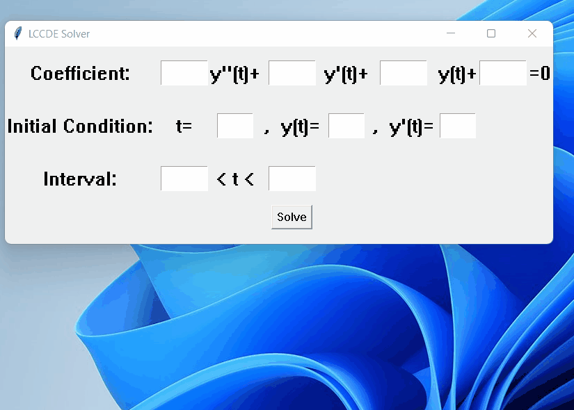

# Simple_Linear_2nd_ODE_Solver_GUI
<h2>Description</h2>

It is a 2nd constant coefficient linear ODE solver with simple GUI using euler's method.

<h2>Needed modules</h2>
matplotlib <a href="https://matplotlib.org/">#</a>

<h2>Demonstration</h2>

